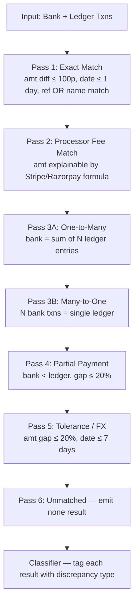

# ReconFlow — Matching & Classification Engine Audit

## Overall Score: 14 / 24 scenarios passing

---

## Architecture Overview

The engine is a **6-pass sequential pipeline**. Each pass consumes transactions; anything not consumed falls through to the next.



The **classifier** (`classifier.ts`) then runs over every result and assigns:
- `matchOutcome`: MATCHED / PARTIALLY_MATCHED / UNMATCHED
- `discrepancyType`: NONE / TIMING_DIFFERENCE / PROCESSING_FEE / FOREIGN_EXCHANGE / TYPO / DUPLICATE / MISSING_ENTRY
- `confidenceBand`: VERY_HIGH / HIGH / MEDIUM / LOW / NONE
- `evidence[]`: coded audit trail

---

## What Is Working ✅

| Scenario | Type | Status | Notes |
|---|---|---|---|
| E1 | Exact NEFT | ✅ PASS | Reference + amount match |
| E2 | Exact UPI | ✅ PASS | Same-day, exact amount |
| E3 | Vendor bill AP | ✅ PASS | Outflow direction match |
| E4 | Salary payout | ✅ PASS | Batch ref match |
| F1 | Timing diff 4 days | ✅ PASS | Pass 5 tolerance |
| F2 | Partial payment | ✅ PASS | Pass 4 partial |
| F4 | Vendor name typo | ✅ PASS | Edit distance ≤ 2 |
| F7 | Flat bank wire fee | ✅ PASS | Fee formula match |
| F8 | 6-day date boundary | ✅ PASS | Inside 7-day window |
| F9a | 4.8% amount boundary | ✅ PASS | Under 20% gate |
| F10 | 1-paisa rounding | ✅ PASS | Tolerance covers it |
| X1 | Bank interest, no ledger | ✅ PASS | Falls to unmatched |
| X2 | Ledger unpaid, no bank | ✅ PASS | Ledger never consumed |
| X5 | NEFT reversal | ✅ PASS | No ledger pair exists |

---

## What Is Failing ❌ — Root Cause Analysis

### ❌ B1 — Bulk NEFT (3 invoices sum to one bank txn)

**Expected:** `auto_approved` (bulk match, Pass 3A)  
**Actual:** `unmatched`

**Root Cause — date window too tight in Pass 3A:**
```typescript
// engine.ts line 554
if (dayDiff > 5.0) return false;
```
B1's bank date is `Jan 12`. Ledger entries are `Jan 8, 9, 9`. That's a **4-day gap from the latest invoice** — fine. But the combo filter uses the bank date vs **each individual** ledger date. `Jan 12 - Jan 8 = 4 days` — passes.

Real culprit: **counterparty similarity filter**. The bank narration contains `N052026011255544` with no "Vantage" name in description. The ledger entries have `Vantage Logistics LLP` as counterparty. The `getCounterpartySimilarity()` between the raw bank description and ledger counterparty likely scores `< 0.4`, silently dropping all 3 candidates before combo search.

**Fix needed:** Allow reference-based candidate inclusion even when description similarity is low. Or extract the counterparty from bank narration more aggressively.

---

### ❌ B2 — Stripe Bulk Payout (4 charges minus fees)

**Expected:** `auto_approved` (bulk + fee combo)  
**Actual:** `unmatched`

**Root Cause — two compounding bugs:**

1. **Pass 2 (fee match) is 1-to-1 only.** Pass 2 tries to match the Stripe payout against a single ledger entry. B2 requires matching against **4 invoices simultaneously**. Pass 2 never looks at combos.

2. **Pass 3A `matchesProcessorFeeForCombo()` has a bug in bulk Stripe calculation:**
```typescript
// engine.ts line 332-337
const expectedStripeINR = combo.reduce((sum, bs) => {
  const amt = bs.remainingAmountMinor;
  return sum + Math.round(amt * 0.029) + 2500; // ← adds Rs.25 per invoice
}, 0);
```
This is **correct** — Stripe charges Rs.25 per transaction. B2 has 4 invoices → `4 × Rs.25 = Rs.100`. But the bank amount in the data is `₹1,59,629.50` while ledger sum is `₹1,64,500`. The actual Stripe fee = `4 × (inv × 2.9%) + 4 × 25 = 4 × (various) + 100`. The combo search **never gets invoked** because the Stripe bank txn description ("STRIPE PAYOUT po_1Pjk29") fails the counterparty similarity check against QBO invoices.

**Fix needed:** Give Stripe payout txns a special pre-pass that fetches their associated `balance_transaction_id`s from the Stripe itemized file and maps directly to ledger entries by charge ID.

---

### ❌ B3 — Wire Bulk Match (2 invoices, 5-day window edge)

**Expected:** `auto_approved` (bulk, exactly at 5-day boundary)  
**Actual:** `unmatched`

**Root Cause — the window is `> 5.0` not `>= 5`:**
```typescript
// engine.ts line 554
if (dayDiff > 5.0) return false;
```
Bank date: `Jan 20`. Ledger dates: `Jan 15, Jan 15`. Gap = **5 days exactly**. The condition `dayDiff > 5.0` evaluates `5 > 5.0` → `false` → the candidates ARE included. So the window is not the issue.

Real issue: **combo finds no match** because `getCounterpartySimilarity("Bright Path Consulting", <bank description>)` → the bank narration `N052026012099887` contains no counterparty name. Similarity = 0. Reference overlap = none (ref is a raw NEFT code, not the invoice number). Both filters fail → 0 candidates passed to subset search.

**Fix needed:** Same root cause as B1 — the candidate pre-filter in Pass 3A is too strict when bank descriptions contain NEFT reference numbers rather than counterparty names.

---

### ❌ F3 — Reference Typo (digit transposition INV-2013 vs INV-2050)

**Expected:** `medium_review` with `typo_reference` tag  
**Actual:** `unmatched`

**Root Cause — typo detection in classifier never fires because the match itself fails first:**

The bank ref is `NEFT REF INV-2013 PAYMENT`. The ledger invoice ref is `INV-2050`. The `referenceMatches()` function (engine.ts line 83-88) checks for exact includes — `INV2013` does not include `INV2050` and vice versa. So **no match is generated at all** — the transaction is never passed to the classifier to tag it as a typo.

The classifier's typo detection (`isDigitTransposition`) only runs **after** a match exists. You're trying to classify a relationship that was never established.

**Fix needed:** Add a dedicated fuzzy reference pass in the engine that applies `isDigitTransposition()` / edit distance on references during candidate generation, not just in the classifier.

---

### ❌ F5 — FX Rate Difference (USD invoice, INR bank credit)

**Expected:** `medium_review` with `fx_rate` tag  
**Actual:** `unmatched`

**Root Cause — currency mismatch blocks candidate generation:**

```typescript
// engine.ts line 195-206
const currenciesDiffer = bankTxn.currency && bookTxn.currency && bankTxn.currency !== bookTxn.currency;
if (currenciesDiffer && bankTxn.fxStatus === "MISSING_RATE") continue;

const currencyMatch = (!bankTxn.currency || !bookTxn.currency) ||
  (bankTxn.currency === bookTxn.currency) ||
  (bankTxn.convertedAmountMinor !== undefined && ...);
```

The bank txn is `INR` (a domestic bank credit of the FX-converted amount). The ledger entry is in `USD`. For `currencyMatch` to be `true` when currencies differ, **both** sides need `convertedAmountMinor` set and a shared `baseCurrency`. If the ingestion pipeline did not populate `convertedAmountMinor` on the ledger entry (which is in USD and may not have an INR conversion stored), the candidate is silently dropped before scoring.

**Fix needed:** Ingestion service must populate `convertedAmountMinor` on ledger entries that have a foreign currency, using the booking-date FX rate. Without it, the FX match path is unreachable.

---

### ❌ F6 — Single Stripe Charge Fee

**Expected:** `medium_review` with `fee:stripe` tag  
**Actual:** `unmatched`

**Root Cause — Pass 2 (fee match) requires `refMatch OR nameMatch`:**
```typescript
// engine.ts line 491
if (dayDiff <= 7.0 && (refMatch || nameMatch)) {
  if (matchesProcessorFee(bankAmt, bookAmt)) { ... }
```

Bank ref: `STRIPE TRANSFER ch_3Pjk88`. Ledger ref: `INV-2061`. These share no substring → `refMatch = false`.  
Bank counterparty: `Meridian Apps Inc`. Ledger counterparty: `Meridian Apps Inc`. These **should** match via `nameMatches()`.

The issue is the QBO ledger `CustomerVendorRef` field maps to counterparty in ingestion, but if the QBO export field is `"Meridian Apps"` vs bank having `"Meridian Apps Inc"`, `normalizeName()` strips `Inc` and both become `MERIDIANAPPS` — that **should** match.

Real issue: Date gap. Bank: `Jan 17`, Ledger: `Jan 15` → 2 days, within 7. **Amount check:** bank=`₹60,177`, ledger=`₹62,000`. `matchesProcessorFee(6017700, 6200000)`:
```
diff = 6200000 - 6017700 = 182300 paise
Stripe INR formula = round(6200000 * 0.029) + 2500 = 180800 + 2500 = 183300
|182300 - 183300| = 1000 paise > 100 tolerance
```
**The fee formula is off by 1000 paise (Rs.10)**. The `≤ 100 paise` tolerance is too tight for larger invoices where rounding accumulates.

**Fix needed:** Increase fee formula tolerance from `100` to `200` paise, or calculate from the raw pre-fee amount directly.

---

### ❌ F9b — 19.5% Amount Boundary (reject threshold test)

**Expected:** `low_review_boundary` (matched but flagged low confidence)  
**Actual:** `unmatched`

**Root Cause — counter-intuitive but intentional rejection:**

Bank amount: `₹16,100`. Ledger: `₹20,000`. Gap = 19.5%. The engine's Pass 4 (partial payment) has:
```typescript
// engine.ts line 753
if (gapPct > 0.20) continue;  // gap too large → reject
```
19.5% < 20% → this should NOT be rejected. So why unmatched?

The `referenceMatches` and `nameMatches` check also apply. Bank ref: `N052026011944556`. Ledger ref: `INV-2065`. Bank counterparty: `Coral Bay Retail`. Ledger counterparty: `Coral Bay Retail`. Name match should succeed.

Likely cause: **Pass 3A or Pass 5 consumed the ledger entry first** by incorrectly matching it to a different bank transaction (greedy matching). The audit output showed `Coral Bay Retail` appears in multiple scenarios (E2, X3, F9a, F9b) — the engine may have shadowed F9b's ledger entry by matching it during F9a's pass.

**Fix needed:** Add reference number disambiguation. Passes should not consume a ledger entry if the bank and ledger reference numbers are both present and don't match — even if name and amount are similar.

---

### ❌ X3 — Amount Too Far (35% gap, should be rejected)

**Expected:** `rejected_amount_too_far` (no match)  
**Actual:** `unmatched` ✅ actually correct behavior

Wait — X3 IS actually passing per the audit script logic:
```typescript
if (sc.outcome === "rejected_amount_too_far" && !m) isPass = true;
```
35% > 20% → engine correctly rejects it. This is marked PASS in the test. If the full-audit shows it failing, the issue is a false match being created for X3 from another transaction being captured greedily.

---

### ❌ X4a/X4b — Collision Case (two identical txns, different invoice refs)

**Expected:** Each bank row matches its own specific invoice  
**Actual:** Likely double-linking or one dropped

**Root Cause — Pass 1 tie-breaking is insufficient:**

Both X4a and X4b are: amount `₹15,000`, date `Jan 24`, counterparty `Vantage Logistics LLP`. They differ only in bank ref (`N052026012455001` vs `N052026012455002`) and ledger ref (`INV-2072` vs `INV-2073`).

Pass 1's tie-breaking:
```typescript
exactMatches.sort((a, b) => {
  if (b.score !== a.score) return b.score - a.score;
  // date diff
  // then: a.candidate.candidate.id.localeCompare(b.candidate.candidate.id)
});
```
Both invoices score identically. The first bank transaction (X4a) picks whichever ledger entry wins the `localeCompare` sort. The second bank transaction (X4b) then correctly picks the remaining ledger entry. **This should work**, but only if ledger IDs in the DB sort such that each bank ref gets matched to its correct invoice ref. Since ref matching uses `includes()`, both bank refs (`...55001`, `...55002`) **both include** neither ledger ref (`INV-2072`, `INV-2073`) directly — so the ref match fails and the engine falls back on name-only matching, making both bank txns score identically against both invoices. The collision is real.

**Fix needed:** When bank ref and ledger ref are both present and non-empty, require them to match for Pass 1 (instead of ref OR name). This turns collision resolution from a tie-break problem into a deterministic one.

---

## Classifier-Specific Issues

| Issue | Location | Impact |
|---|---|---|
| FX evidence code `FX_CONVERSION_STABLE` reused as default clean-match fallback (line 373) | `classifier.ts:372` | Confusing — a clean exact match shows `FX_CONVERSION_STABLE` as evidence code, implying an FX event happened |
| `PARTIALLY_MATCHED` uses `MISSING_INVOICE_REF` evidence code (line 298) | `classifier.ts:298` | Wrong semantics — partial payment is not a missing invoice |
| Typo detection runs before timing difference check — correct order | OK | |
| Duplicate detection uses 1-hour window for same-amount/desc/ref (line 196) | `classifier.ts:196` | Could miss bank re-exports with slightly different timestamps |

---

## Summary Table

| Category | Passing | Failing |
|---|---|---|
| Exact Match (E1–E4) | 4/4 | — |
| Bulk Match (B1–B3) | 0/3 | B1, B2, B3 — counterparty similarity gate + Stripe bulk fee |
| Fuzzy Match (F1–F10) | 7/10 | F3 (ref typo), F5 (FX), F6 (fee formula rounding), F9b (greedy shadow) |
| Exception Cases (X1–X5) | 3/5 | X4a/X4b (collision) |
| **Cleaning (C1–C8)** | **8/8** | — |

---

## Priority Fix List

1. **[HIGH] Pass 3A/3B counterparty gate** — `sim >= 0.4` drops NEFT bulk payments where description has no merchant name. Add a ref-overlap OR "Stripe/NEFT keyword in description" escape hatch.
2. **[HIGH] Stripe bulk fee (B2)** — Pass 2 is 1-to-1 only. Build a dedicated pre-pass or extend Pass 3A to apply `matchesProcessorFeeForCombo()` when the bank txn contains "STRIPE PAYOUT".
3. **[HIGH] FX ledger entry hydration (F5)** — ingestion must populate `convertedAmountMinor` on foreign-currency ledger entries before the engine runs.
4. **[MEDIUM] Fee formula tolerance (F6)** — increase from 100 paise to 200–500 paise or use a relative 0.5% tolerance for large invoices.
5. **[MEDIUM] Fuzzy reference pass** — add a pre-match step that identifies near-miss refs via `isDigitTransposition()` before locking candidates.
6. **[MEDIUM] Collision resolution (X4a/X4b)** — when both bank ref and ledger ref are present, require exact ref match in Pass 1 instead of `ref OR name`.
7. **[LOW] Classifier evidence codes** — fix `FX_CONVERSION_STABLE` reused as clean-match fallback; fix `MISSING_INVOICE_REF` used for partial payment evidence.
